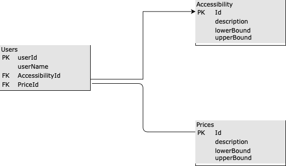

## Introduction
This is a `node` + `express` project that makes API calls to the boredAPI and has some support for `users`.

## Assumptions
When implementing, the following conditions/constraints were taken into account:
 * The API should received some sort of authenticated `bearer_token` identifying the user. I implemented a singled userID in the header to mimic this
 * usernames are not unique, ideally, we wuld have a different column, other than the ID, to also uniquely identify the user (i.d. like email)
 * If a userId is not provided or is not available in the DB, no user is assumed

## API Collections
To create a user:
```
curl --location --request POST 'localhost:3000/user' \
--header 'Content-Type: application/json' \
--data-raw '{
    "username":"test",
    "accessibility": "Low",
    "price": "Low"
}'
```

This should return a userId
```
{
    "id": "4fa25526-4a3d-4dff-9305-cd4e349c7ebd",
    "name": "test",
    "accessibility": "Low",
    "price": "Low"
}
```


To get an activity:
```
curl --location --request GET 'localhost:3000/activity' \
--header 'userId: 4fa25526-4a3d-4dff-9305-cd4e349c7ebd'
```

## DB Schema



## Potential Improvements
The following are potential improvements that were not attempted due to the 2hr time limit

 * IMPORTANT: add some tests
 * Switch to TS
 * Introduce logging
 * More robust error handling


## Running
Assuming nvm already exists, run the following to start. 

This will start a development server in `localhost:3000`

```
nvm i
npm run dev
```

